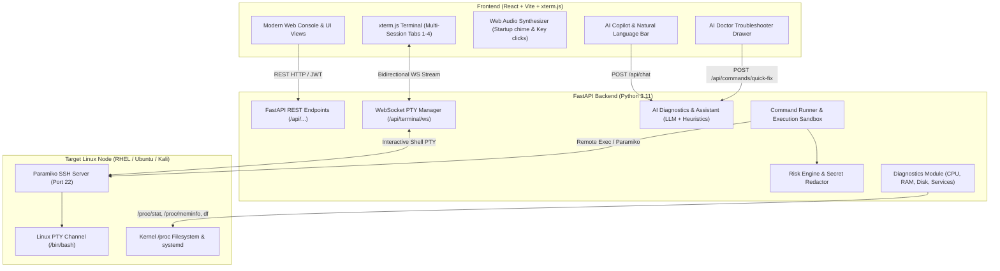

# LinuxAI — System Architecture & Technical Documentation

> **AI-Native Linux Administration Agent & Intelligent Terminal Subsystem**  
> Complete technical reference explaining how the application functions from frontend to kernel.

---

## 1. High-Level Architecture Overview

LinuxAI is an enterprise-grade web-based Linux administration platform that combines **live interactive PTY terminal sessions**, **AI natural-language intent translation**, **autonomous failure troubleshooting ("AI Doctor")**, and **real-time system diagnostics**.



---

## 2. Core Subsystems & How They Work

### A. Terminal & WebSocket PTY Engine (`backend/app/api/terminal_ws.py` & `frontend/src/pages/TerminalPage.tsx`)
- **Interactive Shell Bridging**: When a user opens the terminal, `xterm.js` establishes a persistent WebSocket connection to `/api/terminal/ws?session_id=<id>`.
- **Paramiko PTY Allocation**: The backend connects to the target machine via SSH using Paramiko, calls `client.invoke_shell(term="xterm-256color")`, and spawns two non-blocking async loops:
  1. `ws_to_pty`: Forwards keystrokes from browser to remote shell.
  2. `pty_to_ws`: Reads stdout/stderr chunks from remote shell and streams ANSI bytes to browser xterm.js with sub-15ms latency.
- **Multi-Tab Session Isolation**: Supports up to 4 concurrent independent shell tabs (`bash #1` through `bash #4`).
- **Dynamic Resizing**: `ResizeObserver` detects browser viewport changes and sends JSON `{type: "resize", cols, rows}` to resize the remote Linux PTY via `channel.resize_pty()`.

---

### B. Command Runner & Safety Matrix (`backend/app/executor/`)
Every command issued via the UI, AI Copilot, or automated diagnostics passes through a strict 4-layer execution pipeline:

1. **Risk Engine (`risk.py`)**:
   - Assesses commands against regex rules into 4 risk tiers:
     - `LOW`: Read-only queries (`uptime`, `free`, `ps`, `df`).
     - `MEDIUM`: Safe state checks or benign modifications.
     - `HIGH`: Service restarts, firewall changes, package installs (requires approval or privilege escalation).
     - `BLOCKED`: Destructive commands (`rm -rf /`, `mkfs`, raw disk overwrite `dd if=/dev/zero`).
2. **Secret Redactor (`redactor.py`)**:
   - Masks sensitive tokens, passwords, private keys, and API secrets from output and logs using pattern matching.
3. **Output Sandbox (`sandbox.py`)**:
   - Strips dangerous control codes and caps maximum output buffer to 64KB to prevent browser memory exhaustion.
4. **Execution Protocol (`runner.py`)**:
   - Executes via Paramiko SSH with non-interactive `get_pty=False` for clean diagnostic data, or interactive mode for password prompts (`sudo`, `su`).

---

### C. AI Copilot & AI Doctor Troubleshooter (`backend/app/api/commands.py` & `app/ai/`)
1. **Natural Language Translation**:
   - User types plain English intents (e.g., *"check memory usage"* or *"install python3"*).
   - AI translates intent into exact Linux commands and displays safety explanations.
2. **Context-Aware Failure Diagnostics ("AI Doctor")**:
   - When a command fails with an error (e.g., `Permission denied`, `Unit not found`, `Address already in use`), the ring buffer extracts the error.
   - Cleans ANSI escape codes via regex and queries `/api/commands/quick-fix`.
   - Returns:
     - **Why it failed**: Plain English explanation of the root cause.
     - **Recommended Fix**: Prescribed solution.
     - **Fix Command**: Copyable / executable one-click command (e.g., `sudo systemctl start postgresql`).

---

### D. System Telemetry & Live Diagnostics (`backend/app/diagnostics/system.py`)
- **Kernel-Direct Parsing**:
  - **CPU**: Computes real usage from `/proc/stat` jiffies or `top -bn1` idle metrics.
  - **RAM**: Reads `/proc/meminfo` (`MemTotal`, `MemAvailable`) with fallback to `free -b`.
  - **Disk**: Parses root partition mountpoints via `df -B1` and `df -h /`.
  - **Network & Host Info**: Queries `hostnamectl`, `/proc/loadavg`, and network interfaces.
- **Bottom Telemetry Bar**: Updates every 6 seconds with smooth color-coded health badges.

---

### E. Web Audio Synthesizer Engine (`frontend/src/pages/TerminalPage.tsx`)
- Synthesizes authentic audio effects in real time using the Web Audio API (`AudioContext`):
  - **Ubuntu / Linux Startup Chime**: 4-note ascending chord (`D4 - A4 - D5 - F#5`) with marimba/bell harmonics.
  - **Tactile Key Clicks**: Synthesized mechanical switch clicks on keypress.
  - **Enter Key Resonance**: Low-frequency tactile resonance drop on execution.
  - **Terminal Bell (`\x07`)**: Crisp 880 Hz console warning ping.
  - **Distro Sound Chimes**: Cyber scan pulse for Kali, crystal harmonic for Nord.

---

## 3. Directory Structure

```text
AILinux/
├── backend/
│   ├── app/
│   │   ├── api/             # FastAPI Endpoints (system, terminal_ws, ssh, commands, chat, auth)
│   │   ├── ai/              # AI Assistant, Prompts, and Diagnostics
│   │   ├── diagnostics/     # System, Services, Storage, Security, Network checkers
│   │   ├── executor/        # Command Runner, Risk Engine, Sandbox, Secret Redactor
│   │   ├── models/          # User & Command DB Models
│   │   ├── schemas/         # Pydantic Request/Response Models
│   │   ├── config.py        # Environment Configuration
│   │   └── main.py          # FastAPI Application Entrypoint
│   ├── tests/               # Pytest Automated Test Suites (10-command failure tests, security tests)
│   └── requirements.txt     # Python Dependencies
├── frontend/
│   ├── src/
│   │   ├── components/      # UI Modals, Titlebars, Navbars, VimEditorModal
│   │   ├── pages/           # TerminalPage, DashboardPage, SystemMonitor, Processes, Services, Storage
│   │   ├── services/        # Axios API Client & Endpoints
│   │   ├── index.css        # Core Design System & Tokens
│   │   └── App.tsx          # App Router & Layout
│   ├── package.json         # Node Dependencies (Vite, React, Tailwind, xterm)
│   └── vite.config.ts       # Vite Configuration
├── run.bat                  # One-Click Launch Script (Backend + Frontend)
└── PROJECT_OVERVIEW.md      # Complete Architecture Documentation
```

---

## 4. How to Run Locally

1. **Prerequisites**:
   - Python 3.10+
   - Node.js 18+
2. **Start Backend & Frontend**:
   ```powershell
   .\run.bat
   ```
   - **Frontend UI**: `http://localhost:5173`
   - **Backend Swagger API Docs**: `http://localhost:8000/docs`
   - **Default Login**: `admin` / `admin123`

---

## 5. Recommended Future Improvements & Next Steps

Here are the highest-impact enhancements you can consider for future versions:

1. **Multi-Host Server Fleet Inventory**:
   - Add a server switcher dropdown to manage multiple remote servers (e.g., `prod-web-01`, `db-cluster-02`, `k8s-master`) simultaneously from the same console.
2. **Session Recording & Audit Playback**:
   - Implement asciinema / WebM terminal session recording to export and review all executed commands for team audits and compliance.
3. **Air-Gapped Local LLM Mode (Ollama / DeepSeek-R1)**:
   - Add toggle for local on-premise LLMs via Ollama so AI diagnostics work in completely offline / air-gapped environments without internet access.
4. **Role-Based Access Control (RBAC)**:
   - Create user roles (`Read-Only Operator`, `DevOps Engineer`, `Super Admin`) with granular restrictions on which commands can be run.
